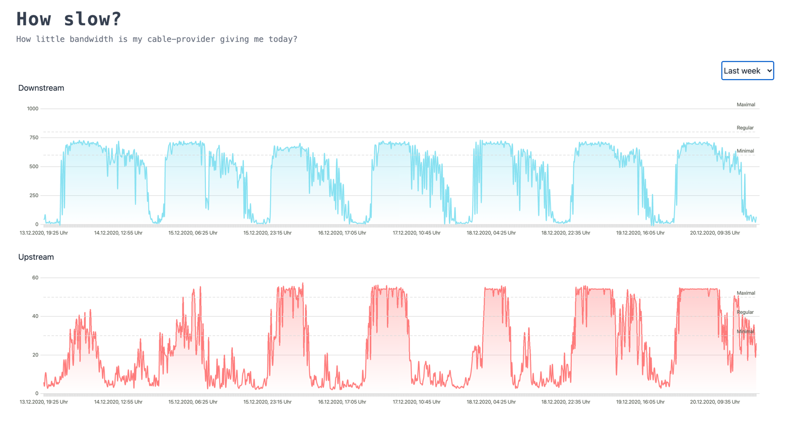

# 🐌 How slow?



Measures and visualizes my actual internet speed.

## How does it work

- Speeds are measured using [speedtest.net](https://www.speedtest.net/de) with the identical upstream server every ten minutes by a RaspberryPi4 that is connected via Gigabit-LAN with a cronjob `server/run-speedtest-cron.ts`.
- The Pi is the only device on the whole network in order to not distort the results.
- The results are saved in a sqlite-database that is connected via [Prisma](https://www.prisma.io/)
- A [Fastify](https://www.fastify.io/)-Server provides an API to query the data from a specific timestamp
- A [Svelte](https://svelte.dev/)-App visualizes the results in several graphs

## How bad is it?

Pretty bad. I only get the minimal speeds that are accepted by the german Bundesnetzagentur which correspond to 60% of the billed speeds during the night. In the evenings the downstream speeds fall below rates that are usable for video-streaming. During the day from 8am onwards upstream speeds fall beyond what is usable for video conferencing and thus working from home.

## Make Prisma run on RaspberryPi

Prisma does not support ARM-architectures out of the box. You can compile the necessary binaries with Rust by yourself by following these instructions: https://github.com/prisma/prisma/issues/1505#issuecomment-634154657

## Configure cron to run a speedtest on Pi every 10 minutes

1. Open all configured crontabs with `crontab -e`
2. Add the following line

```sh
5-59/10 *  * * * /home/pi/dev/svelte-speedtest/server/run-speedtest-cron.ts >> /home/pi/dev/lu-speedtest/run.log 2>&1
```

## Sync DB with RaspberryPi

```sh
rsync -avz --progress pi@raspberrypi:/home/pi/dev/svelte-speedtest/src/server/prisma/speedtest.db ./server/prisma/speedtest.db
```
